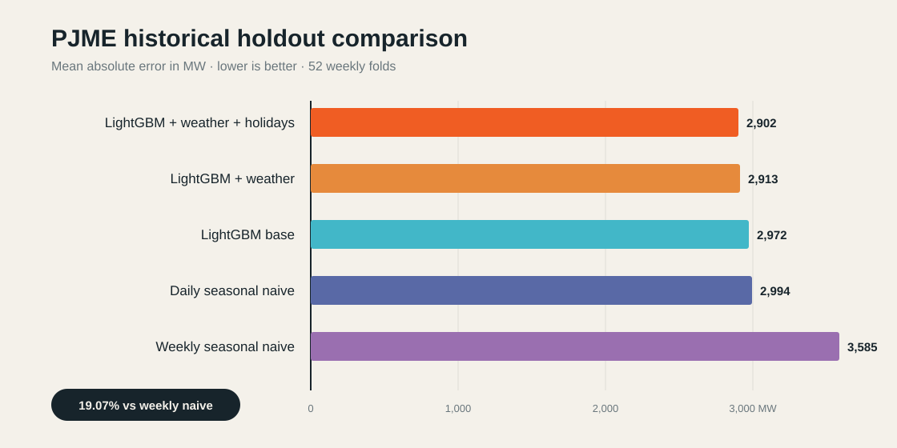

# GridCast

[](https://github.com/gioalvari/gridcast/actions/workflows/quality.yml)
[](https://www.python.org/)
[](LICENSE)

GridCast is a reproducible energy forecasting workbench focused on honest
temporal validation, uncertainty, and operationally meaningful evaluation.
It now also contains the former GridLens operational day-ahead work, so there is
one canonical energy-forecasting repository rather than two overlapping ones.



On the repeatedly inspected 52-week historical holdout, the combined LightGBM
model has the lowest observed aggregate MAE among task-trained and classical
models: **19.07%** below the weekly
seasonal-naive baseline, **3.07%** below the stronger daily seasonal-naive
baseline, and **2.38%** below base LightGBM. The daily baseline wins the most
individual weeks, and uncertainty around these small paired differences is not
resolved by the paired four-week block bootstrap: the 95% interval for the MAE
improvement is **-431.87 to 562.71 MW**. This is not evidence of reliable model
superiority; its Bonferroni-adjusted interval is **-633.18 to 713.83 MW**.

An optional Apache-2.0 **TimesFM 2.5 200M zero-shot** benchmark reaches
**1,926.88 MW MAE**, 33.59% below combined LightGBM without task-specific PJME
fine-tuning in GridCast. This result is reported separately because overlap with
broad foundation-model pretraining data cannot be ruled out. See
[FOUNDATION_MODELS.md](FOUNDATION_MODELS.md).

GridCast also includes an optional TimesFM 3.0 research adapter. Its pretrained
weights have a separate non-commercial license, are never redistributed, and
are excluded from production-oriented claims and defaults.
On the same historical holdout, it reaches **1,763.63 MW MAE** and **80.11%** raw
P10-P90 coverage, but the repeatedly inspected period and possible pretraining
overlap prevent an untouched generalization claim.
Its observed `163.25 MW` improvement over TimesFM 2.5 is also uncertain after
weekly dependence is respected: the 95% interval is **-226.76 to 567.98 MW**.
Its adjusted interval is **-357.03 to 708.19 MW**. See
[MODEL_COMPARISON.md](MODEL_COMPARISON.md) for the specified six-pair family and
multiplicity-adjusted results.

## Why this project

Forecasting examples often use random train/test splits, which leak future
information into model evaluation. GridCast uses strict chronological
walk-forward validation, explicit daily and weekly baselines, a historical
holdout, and validation-only conformal calibration.

## Quick start

Requirements: Python 3.11+ and
[`uv`](https://docs.astral.sh/uv/getting-started/installation/).

```bash
make install
make full
make demo
make comparison  # after benchmark and both optional TimesFM runs
```

The demo writes the following reproducible artifacts to `artifacts/demo/`:

- `load.csv`: generated hourly load data
- `forecasts.csv`: timestamped out-of-sample predictions by fold
- `metrics.csv`: MAE, RMSE, and MASE for each fold
- `summary.json`: aggregate metrics and experiment configuration

Run a customized backtest:

```bash
uv run gridcast demo \
  --periods 3360 \
  --initial-window 2016 \
  --horizon 168 \
  --step 168 \
  --seed 42 \
  --output-dir artifacts/demo
```

## Real PJM data

Download and normalize the public PJME dataset, then create the EDA report:

```bash
make data
make weather
make eda
```

The data command:

- downloads `PJME_hourly.csv` from the CC0 Kaggle dataset;
- records duplicates and missing hours in a JSON quality report;
- averages duplicate wall-clock timestamps;
- interpolates only short gaps of at most three hours;
- validates positive loads and a complete hourly frequency;
- writes a Snappy-compressed Parquet cache under the ignored `data/` folder.

The EDA command produces descriptive statistics, daily averages, hourly and
weekly profiles, and two publication-ready PNG charts in `artifacts/eda/`.
See [PJME_EDA.md](PJME_EDA.md) for the current findings and
[DATA_SOURCES.md](DATA_SOURCES.md) for provenance and timestamp caveats.

## ENTSO-E data

GridCast can also ingest authenticated actual total load from the ENTSO-E
Transparency Platform. The token is never stored in the repository.

```bash
uv run gridcast data entsoe --start 2024-01-01 --end 2025-01-01
```

Locally, the command reads the token from the macOS Keychain service
`gridcast-entsoe-api-token`; in CI it reads the `ENTSOE_API_TOKEN` secret. A
manual GitHub Actions workflow is included for bounded smoke tests. See
[DATA_SOURCES.md](DATA_SOURCES.md) for scope, licensing, and security details.

## Operational day-ahead contracts

The Italian track makes data availability explicit: each forecast has a 10:00
Europe/Rome D-1 origin, a DST-safe 23/24/25-hour delivery day, and one immutable
ECMWF run that must have been published before issuance.

```bash
uv run gridcast day-ahead contract --delivery-date 2026-08-30
uv run gridcast day-ahead check-weather --delivery-date 2026-08-30
```

It also adds asymmetric shortage/surplus decision costs and their cost-optimal
forecast quantile. See
[Operational day-ahead contract](docs/day-ahead-contract.md) and
[GridLens consolidation](docs/gridlens-migration.md).

## Real-data benchmark

Run the chronological PJME benchmark after preparing the data:

```bash
make benchmark
```

The benchmark compares persistence, daily seasonal naive, weekly seasonal
naive, LightGBM, and separate holiday, weather, and combined ablations. Target
and observed-weather features are delayed by at least 168 hours; federal
holidays are known in advance; and temperature climatology uses prior years
only. The entire weekly horizon is therefore generated without reading realized
values inside that horizon. The final 52 weeks form a historical holdout; the
preceding 12 weeks form the development validation period. Because holdout
findings informed later experiments, GridCast does not describe this period as
an untouched final test.

Outputs under `artifacts/benchmark/` include the leaderboard, fold-level
metrics, timestamped predictions, configuration metadata, and diagnostic
charts. See [PJME_BENCHMARK.md](PJME_BENCHMARK.md) for results and limitations.
Each run also emits an auditable
[experiment manifest](docs/experiment-manifests.md) with Git, configuration,
feature, dependency, and dataset hashes.

### Historical holdout benchmark

| Model | MAE (MW) | RMSE (MW) | MASE | MAE vs weekly naive |
|---|---:|---:|---:|---:|
| LightGBM + weather + holidays | **2,901.57** | **3,934.23** | **0.962** | **+19.07%** |
| LightGBM + weather | 2,913.06 | 3,964.45 | 0.966 | +18.74% |
| LightGBM base | 2,972.24 | 4,005.40 | 0.986 | +17.09% |
| Daily seasonal naive | 2,993.52 | 3,998.30 | 0.992 | +16.50% |
| Weekly seasonal naive | 3,585.07 | 4,856.16 | 1.189 | baseline |

## Probabilistic forecasting

Train P10, P50, and P90 models and calibrate the 80% interval using only the
validation folds:

```bash
make probabilistic
```

The raw quantile interval covers 57.59% of holdout observations. A
validation-only split-conformal correction increases coverage to 80.04%, close
to the 80% target, while increasing mean interval width from 5,842 to 8,985 MW.
An hour-conditional variant reduces mean hourly coverage error by 28.5%, from
2.40 to 1.72 percentage points, at the cost of 4.2% wider intervals and 81.40%
aggregate coverage.
A 12-week causal rolling experiment reaches 79.52% coverage but makes intervals
2.64% wider and does not improve week-level calibration. It is retained as a
documented negative result rather than replacing the static global method.
See [PJME_PROBABILISTIC.md](PJME_PROBABILISTIC.md) for pinball losses,
methodology, and limitations.

## Decision-aware evaluation

GridCast evaluates schedules under symmetric, shortage-heavy, and surplus-heavy
synthetic penalties. It compares point-model schedules and tests whether using
the cost-optimal quantile (P25/P50/P75) improves on always scheduling P50. See
[DECISION_EVALUATION.md](DECISION_EVALUATION.md).

## Pretrained TimesFM

Run the pinned TimesFM 2.5 zero-shot benchmark on macOS 14+ Apple silicon in an
isolated Python 3.12.12 environment:

```bash
make timesfm
```

The command downloads approximately 882 MiB of Apache-2.0 weights on first use.
TimesFM and PyTorch are not part of the standard GridCast installation. An
optional `make timesfm3` research benchmark is also available after reading its
separate non-commercial, non-production weights license. GridCast does not
redistribute either checkpoint.

## Interactive dashboard

After generating the data and experiment artifacts, launch the portfolio UI:

```bash
make dashboard
```

The Streamlit dashboard opens at `http://localhost:8501` and provides:

- the complete PJME demand history and headline dataset statistics;
- the historical holdout leaderboard and model ablations;
- an interactive weekly comparison of actuals and point forecasts;
- calibrated probabilistic intervals and coverage diagnostics;
- the optional TimesFM zero-shot benchmark and runtime metadata;
- dependence-aware paired effects and confidence intervals;
- optional local fit, latency, size, and memory measurements;
- a concise explanation of the anti-leakage evaluation contract.

## Local inference performance

Measure fit time, warm weekly prediction latency, throughput, serialized model
size, and indicative process-memory change:

```bash
make performance
```

On an Apple silicon development machine, both 300-tree LightGBM variants served
the complete 168-hour horizon in under one millisecond median in-process latency
after warmup. See [PERFORMANCE.md](PERFORMANCE.md) for the hardware-qualified
protocol, results, and limitations.

## Read-only API

Serve the generated artifacts through FastAPI:

```bash
make api
```

OpenAPI documentation is available at `http://localhost:8000/docs`. The API
exposes health, metadata, leaderboard, point-forecast, calibrated probabilistic
forecast, decision-sensitivity, foundation-model, and optional local-performance
endpoints, plus optional statistical comparisons at `/api/v1/comparisons`. It
returns `503` with setup instructions when core artifacts are
unavailable and `404` if optional results have not been generated.
The `/health` endpoint reports process liveness, while `/ready` returns success
only after the required core artifact bundle loads and validates.

Build the same service as a container:

```bash
make docker-build
docker run --rm -p 8000:8000 \
  -v "$PWD/data:/app/data:ro" \
  -v "$PWD/artifacts:/app/artifacts:ro" \
  gridcast:latest
```

## Methodology

- **Frequency:** hourly
- **Forecast horizon:** 168 hours (one week)
- **Baselines:** persistence, previous day, and previous week
- **Validation:** expanding training window with non-overlapping weekly folds
- **Metrics:** MAE, RMSE, and MASE
- **Paired uncertainty:** four-week circular block bootstrap over weekly MAE
- **Data:** public PJME hourly load and Philadelphia ERA5 temperature; synthetic
  demand is retained only for the offline demo and tests

MASE scales absolute error by the in-sample seasonal-naive error. Values below
1.0 indicate an improvement over the in-sample seasonal-naive benchmark.

## Architecture

```text
PJM load + ERA5 temperature
            |
            v
Quality checks + leakage-safe features
            |
            v
Weekly walk-forward validation and historical holdout
            |
            +--> point models and ablations
            |
            +--> P10 / P50 / P90 --> validation-only conformal calibration
                                      |
                                      v
                         Metrics, forecasts, and charts
```

## Roadmap

- Seasonal conformal calibration
- Italian day-ahead benchmark with archived weather vintages
- Decision regret and day-block confidence intervals
- Deployment of the API and dashboard to a public demo environment

## Development

```bash
make format  # apply Ruff formatting and safe fixes
make check   # lint, formatting check, and strict mypy
make test    # tests with branch coverage >= 90%
make full    # all checks and tests
```

## Limitations

The public PJME dataset ends in 2018, and a single Philadelphia weather point
cannot represent the complete PJM East footprint. ERA5 is reanalysis rather
than an archived operational forecast, so GridCast uses it only through delayed
values and prior-year climatology. Reported results are research benchmarks,
not evidence of production readiness.

## License

MIT
