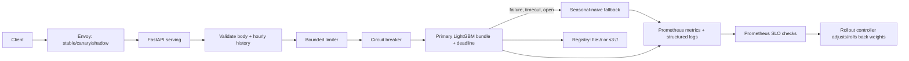

# GridCast production serving

This directory records the serving contract and the operational decisions around
`gridcast.serving.app:create_app`. The generated API contract is
[`openapi.json`](openapi.json); CI rejects unreviewed changes and breaking PR
changes relative to the base branch.

`/live` answers process liveness. `/ready` answers only after the native bundle
has resolved, verified, loaded, and warmed. `/health` is a bounded operational
state view; `/metrics` exposes only `gridcast_` Prometheus collectors.

The deprecated `/v1/forecasts` endpoint supplies `Deprecation`, `Sunset`, and
successor `Link` headers. New callers must use `/v2/forecasts`, which returns
point and calibrated interval values and explicitly says whether it degraded.

## Reading order

- [Serving standard](serving-standard.md): reusable team requirements.
- [Production readiness review](production-readiness-review.md): current facts.
- [Runbook](runbook.md) and [threat model](threat-model.md): operate safely.
- [ADRs](adr/): the decisions that constrain compatible changes.
- [Load-test plan template](load-test-plan-template.md) and
  [review checklist](code-review-checklist.md): evidence expected from PRs.
