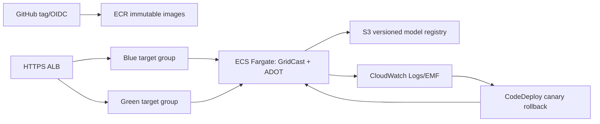

# GridCast AWS reference deployment

> **Status: validated statically, never applied.** This is a reference topology,
> not evidence of an AWS deployment or an approved production account.

The inputs deliberately reuse an existing VPC: provide private task subnets,
public ALB subnets, and an ACM certificate. The registry bucket is versioned,
KMS-encrypted, public-access-blocked, TLS-only, and keeps noncurrent versions
for 90 days. `enable_object_lock` is an explicit creation-time choice because
enabling it after creation replaces the bucket. WAF is intentionally not
provisioned: associate an account-approved Web ACL with the public ALB before
Internet-facing use.

The Fargate task has a read-only root filesystem and runs as a non-root user.
Fargate does not offer `tmpfs`; the task definition therefore mounts a blank
ephemeral task volume at `/tmp`, where the serving code caches a downloaded
bundle. The 20-second `stopTimeout` matches Uvicorn graceful shutdown.

The ADOT sidecar scrapes `localhost:8080/metrics` and emits EMF metrics in
`GridCast/Serving`. In particular it exports `gridcast_fallbacks_total`; the
fallback alarm divides it by `gridcast_predictions_total`. This is a reference
mapping—confirm ADOT/EMF metric dimensions and naming in the target account, or
use Amazon Managed Prometheus with an equivalent alert.

## Local-to-AWS mapping

| Local stack | AWS reference |
|---|---|
| Envoy runtime weights | CodeDeploy 10%-for-5-minutes blue/green canary |
| Prometheus SLO rollout checks | CloudWatch target 5xx, target p95, fallback-rate rollback alarms |
| LocalStack S3 model URI | KMS-encrypted, versioned S3 model registry |

## Real deployment procedure

1. Review `terraform.tfvars.example`; create an account-specific `terraform.tfvars`
   outside source control with valid network, certificate, image, and secret ARNs.
2. Add a remote backend before shared use, for example an encrypted versioned S3
   state bucket plus DynamoDB locking (or a Terraform Cloud workspace). No backend
   is committed so static validation cannot reach an account.
3. Authenticate with a dedicated deployment role, then run `terraform init`,
   `terraform plan -out=tfplan`, peer-review the plan, and only then have an
   authorized operator apply it. This repository intentionally does not automate
   those account-mutating steps.

## Cost framing

Fixed drivers are an ALB, NAT gateways used by private Fargate tasks, and the
minimum Fargate task count. Approximate monthly cost is:

`ALB hourly price × 730 + LCU-hours × LCU price + NAT hourly price × 730 × NATs
+ NAT GB processed × price + task vCPU-hours × price + task GB-hours × price`.

CloudWatch logs/metrics, ECR/S3 storage and requests, KMS, data transfer, and
CodeDeploy can add costs. **Check current regional AWS prices before approval**;
this document intentionally contains no stale price claim.
